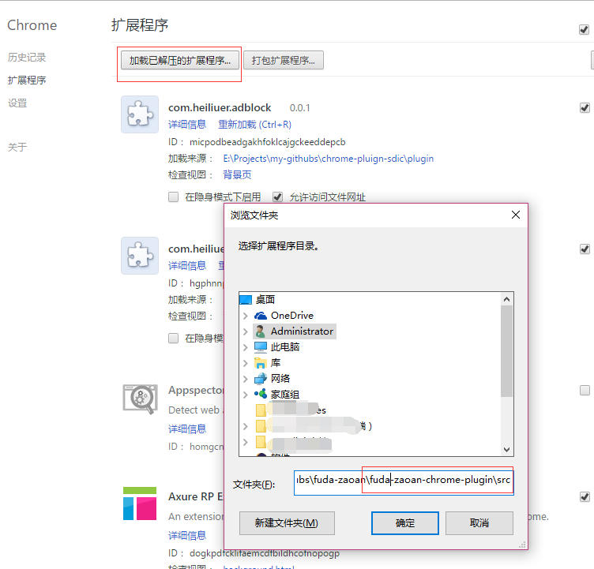
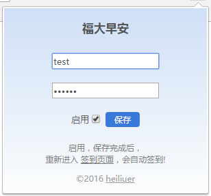

# 福大早安，自动签到chrome插件
----
## 如何使用

1. 下载 [项目源码](https://github.com/heiliuer/fuda-zaoan/raw/master/fuda-zaoan-chrome-plugin//fuda-zaoan-chrome-plugin.zip)

1. 打开chrome浏览器，访问地址  [chrome://extensions/](chrome://extensions/) 

2. chrome 加载已解压的扩展程序...,选择 1 步已下载并解压的源码 `fuda-zaoan-chrome-plugin\src` 目录

	

3. chrome 打开任意网页，点击右上角出现的   图标

4. 在4步出现的窗口中输入学号，密码，选中启用，点击保存

	

5. 打开 `fuda-zaoan-chrome-plugin\start.bat` 批处理文件，chrome会自动打开福大早安主页，并签到

