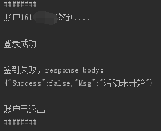

# 早安福大，自动签到程序

## 如何使用

- 安装 nodejs

- 安装依赖库,执行命令

    - `npm install --registry=https://registry.npm.taobao.org`

- 配置用户账户，编辑 `user.js` 文件

- 开始签到

    - 执行命令

    - `node extends.js`
    
    - 或者运行批处理文件
    
    - `start.bat`

## 效果
    

